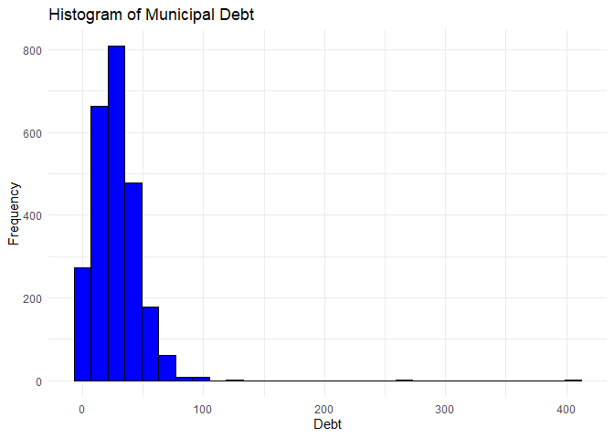
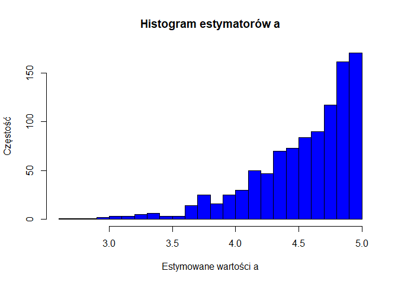

Lab3 - Wczytywanie danych. Przedziały ufności
================
Dzmitry Navumau
February 2024

**Zadanie 1.** Wczytamy dane z pliku `Zadluzenie gmin.csv`. Chcemy
sprawdzić, czy są jakies dane nie typowe dla polskiej gminy.

W tym celu zbieramy podstawową informację o zadłużeniach

``` r
Zadluzenie.gmin <- read.delim("E:/Study/MIMUW/6 semestr/SAD/Repositories/Lab-3-Confidence-interval/Data/Zadluzenie gmin.csv")
summary(Zadluzenie.gmin$Zadłużenie.gmin)
```

    ##    Min. 1st Qu.  Median    Mean 3rd Qu.    Max. 
    ##    0.00   15.18   26.09   27.69   37.80  405.66

``` r
sd(Zadluzenie.gmin$Zadłużenie.gmin)
```

    ## [1] 19.1929

``` r
mean(Zadluzenie.gmin$Zadłużenie.gmin)
```

    ## [1] 27.68867

Przedstawiamy dane na wykresie:

``` r
library(ggplot2)
ggplot(data = Zadluzenie.gmin, aes(x = Zadluzenie.gmin$Zadłużenie.gmin)) +
  geom_histogram(bins = 30, fill = "blue", color = "black") +
  theme_minimal() +
  labs(title = "Histogram of Municipal Debt", x = "Debt", y = "Frequency")
```

<!-- -->

Usuwamy dane dotyczące regiona Ostrowice, bo nie są typowymi dla naszej
analizy:

``` r
Zadluzenie.gmin <- Zadluzenie.gmin[Zadluzenie.gmin$Region != "Ostrowice", ]
```

Przedstawiamy dane na wykresie jeszcze raz:

``` r
library(ggplot2)
ggplot(data = Zadluzenie.gmin, aes(x = Zadluzenie.gmin$Zadłużenie.gmin)) +
  geom_histogram(fill = "blue", color = "black") +
  theme_minimal() +
  labs(title = "Histogram of Municipal Debt", x = "Debt", y = "Frequency")
```

    ## `stat_bin()` using `bins = 30`. Pick better value with `binwidth`.

<!-- -->

**Zadanie 2.** Za pomocą wykresu kwantylowego oceniamy jak rozkład
zadłużenia odbiega od rozkładu normalnego.

``` r
qqplot_zadluzenia <- ggplot(data = Zadluzenie.gmin, aes(sample = Zadluzenie.gmin$Zadłużenie.gmin)) + 
  stat_qq() + 
  stat_qq_line(colour = "red") + 
  ggtitle("Wykres kwantylowy zadłużenia gmin") +
  xlab("Kwantyle teoretyczne") +
  ylab("Kwantyle obserwowane")


qqplot_zadluzenia
```

    ## Warning: Use of `Zadluzenie.gmin$Zadłużenie.gmin` is discouraged.
    ## ℹ Use `Zadłużenie.gmin` instead.
    ## Use of `Zadluzenie.gmin$Zadłużenie.gmin` is discouraged.
    ## ℹ Use `Zadłużenie.gmin` instead.

<!-- -->

## Przedziały ufności

**Zadanie 3.** Wczytujemy dane `iris` i wybieramy wiersze odpowiadające
gatunkowi *versicolor*.Sprawdzamy, czy zmienna `Sepal.Width` (mierząca
szerokość działki kielicha) ma rozkład normalny.

``` r
data(iris)
iris_versicolor <- subset(iris, iris$Species == "versicolor")

ggplot(iris_versicolor, aes(sample = iris_versicolor$Sepal.Width)) + 
  stat_qq() + 
  stat_qq_line(colour = "red") + 
  ggtitle("Wykres kwantylowy dla Sepal.Width gatunku Versicolor") +
  xlab("Kwantyle teoretyczne") +
  ylab("Kwantyle obserwowane")
```

    ## Warning: Use of `iris_versicolor$Sepal.Width` is discouraged.
    ## ℹ Use `Sepal.Width` instead.
    ## Use of `iris_versicolor$Sepal.Width` is discouraged.
    ## ℹ Use `Sepal.Width` instead.

<!-- -->

Możemy, patrząc na ten wykres zalożyć, że szerokość działki kielicha ma
rozkład normalny Obliczamy przedział ufności dla średniej wartości tej
zmiennej na poziomie $\alpha = 0.95$. W tym celu wykorzystujemy wzór na
tzw. *studentyzowany przedział ufności*:
$$\left(\bar{X} - \frac{t(1-\alpha/2, n-1)}{\sqrt{n}}\hat{S}, \bar{X} + \frac{t(1-\alpha/2, n-1)}{\sqrt{n}}\hat{S}\right),$$
gdzie $\bar{X}$ to średnia, $\hat{S}$ to pierwiastek z *nieobciążonego*
estymatora wariancji (czyli wynik funkcji `sd()`), a
$t(1-\alpha/2, n-1)$ to kwantyl na poziomie $1-\alpha/2$ dla rozkładu t
Studenta o $n-1$ stopniach swobody

``` r
mean_sepal_width <- mean(iris_versicolor$Sepal.Width)
sd_sepal_width <- sd(iris_versicolor$Sepal.Length)
n <- nrow(iris_versicolor)
alpha <- 0.05
t_critical <- qt(1 - alpha/2, df = n-1)

margin_error <- t_critical * sd_sepal_width / sqrt(n - 1)
ci_lower <- mean_sepal_width - margin_error
ci_upper <- mean_sepal_width + margin_error
```

    ## Średnia Sepal.Width dla Versicolor: 2.77

    ## Przedział ufności (95%): ( 2.621816 ,  2.918184 )

Jesteśmy w 95% pewni, że rzeczywista średnia szerokość działki kielicha
dla tego gatunku leży w tym zakresie. Jeżeli byśmy nie mieli założenia o
normalnosci, te wyniki nie mieli by sensu, ponieważ to założenie jest
kluczowym do zastosowania kwantyli rozkładu t-studenta

**Zadanie 4.** Porównamy wyniki z poprzedniego zadania z tzw.
*asymptotycznym przedziałem ufności*, danym wzorem
$$\left( \bar{X} - \frac{q(1-\alpha/2)}{\sqrt{n}}\hat{S}, \bar{X} + \frac{q(1-\alpha/2)}{\sqrt{n}}\hat{S} \right),$$
gdzie $q(1-\alpha/2)$ jest kwantylem na poziomie $1 - \alpha/2$ ze
standardowego rozkładu normalnego.

``` r
mean_sepal_width <- mean(iris_versicolor$Sepal.Width)
sd_sepal_width <- sd(iris_versicolor$Sepal.Length)
n <- nrow(iris_versicolor)
alpha <- 0.05
z <- qnorm(1 - alpha/2)

margin_error_norm <- z * sd_sepal_width / sqrt(n)
ci_lower_norm <- mean_sepal_width - margin_error_norm
ci_upper_norm <- mean_sepal_width + margin_error_norm
```

Asymptotyczny przedział będzie zazwyczaj bardziej precyzyjny w dużych
próbach, natomiast przedział t-Studenta jest bardziej odpowiedni dla
mniejszych prób i bardziej konserwatywny, gdy rozmiar próbki jest
niewielki i/ lub dane są mniej normalnie rozłożone.

    ## Asymptotyczny przedział ufności (95%): ( 2.626927 ,  2.913073 )

**Zadanie 5(dodatkowe)** Następnie:  
1. Przedstaw otrzymane wartości $\hat{a}$ na histogramie.  
2. Oblicz przedział ufności dla próby numer 1 korzystając ze wzoru
$$(\max(X_n), \frac{\max(X_n)}{\alpha^{1/n}})$$.  
3. Oblicz przedział ufności dla każdej próby i sprawdź, dla ilu prób
przedział zawiera prawdziwą wartość parametru $a$.

Wylosujemy 1000 prób po 10 obserwacji z rozkładu jednostajnego na
przedziale $[0, a]$ dla wybranej wartości parametru $a$.

``` r
set.seed(123)

a <- 5  # Zakres maksymalny dla rozkładu jednostajnego
n <- 10  # Liczba obserwacji w próbie
m <- 1000  # Liczba prób

# Generowanie prób i obliczanie estymatora
samples <- replicate(m, runif(n, 0, a))
```

Wykorzystamy te próbki do estymacji parametru $a$ metodą największej
wiarygodności: $\hat{a} = \max_i X_i$.

``` r
estimates <- replicate(m, max(runif(n, 0, a)))

hist(estimates, breaks = 30, col = 'blue', main = "Histogram estymatorów a",
     xlab = "Estymowane wartości a", ylab = "Częstość")
```

<!-- -->

Obliczamy przedział ufności dla każdej próby i sprawdzamy, dla ilu prób
przedział zawiera prawdziwą wartość parametru $a$.

``` r
# Funkcja do obliczania przedziałów ufności dla jednej próbki
calculate_ci <- function(sample) {
  max_xn <- max(sample)
  ci_lower <- max_xn
  ci_upper <- max_xn * (n / (n - 1))
  c(ci_lower, ci_upper)
}

# Obliczanie przedziałów ufności dla wszystkich prób
ci_bounds <- apply(samples, 2, calculate_ci)

# Sprawdzanie, ile przedziałów zawiera wartość a
contains_a <- apply(ci_bounds, 2, function(ci) a >= ci[1] && a <= ci[2])
count_contains_a <- sum(contains_a)
```

    ## Liczba prób, dla których przedział ufności zawiera wartość a: 625
